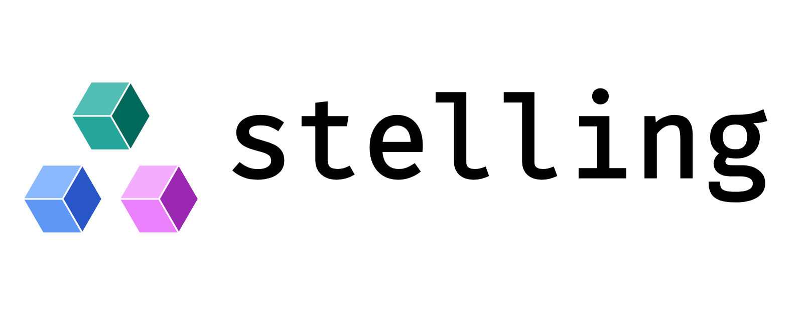

# Stelling
Inspired by Kani, Stelling is an assertion-based verifier for JAX array
programs. Today it checks stated box invariants of continuous flows by
forward interval propagation over the traced jaxpr — outward-rounded —
escalating obligations the intervals cannot decide to an SMT portfolio
(cvc5/Z3, opt-in extras), with a stamp on every verdict naming its own
assumptions.
<!-- capability-exempt: roadmap -->
The roadmap (`design/founding.md`) aims it further: index safety, and
bounds over horizons no test can reach.
<!-- /capability-exempt -->

*stelling is not affiliated with or endorsed by the JAX project.*

## What it does — and what it doesn't, measured

**Does:**

- Checks **stated box invariants on continuous flows** (edge-flux
  inductiveness): the harness declares bounded inputs
  (`any_array`), obligations (`assert_`), and membership of known data in
  the declared set (`nonvacuity`) — all as traced primitives, so the
  query's content hash covers the declarations, not just the program.
- **Forward interval propagation** over the jax-free IR
  (`stelling.ir`), outward-rounded (one deliberate ulp per operation),
  with three-valued verdicts: **VERIFIED**, **REFUTED** (set-level: the
  stated box is not invariant — not a witness), **UNKNOWN** (our
  imprecision, never guessed away).
- **Checks the preconditions your solver assumes** — positivity of a
  coefficient field over its envelope, a nonzero mass/shift scalar over
  its admissible config range — as reusable obligation templates
  (`stelling.preconditions`) with a one-call front door (`check()`), each
  verdict stamped. Guide: [docs/preconditions.md](docs/preconditions.md).
- **Escalates undecided obligations to SMT solvers** (optional extras,
  never required): scalar linear/polynomial obligations emit as
  SMT-LIB2 text — exact dyadic rationals, the closed declared box, the
  negated predicate — routed by fragment through a portfolio (cvc5 with
  coverings for nonlinear, Z3 as cross-check). Agreement decides;
  disagreement is a loud error, never a silent pick. `sat` becomes
  **REFUTED with a concrete witness**, checked for box membership and
  predicate violation by exact-rational replay before it is believed;
  timeout or `unknown` stays UNKNOWN — a timeout is never a VERIFIED;
  unsupported fragments stay UNKNOWN with the reason quoted.
- **Every verdict carries a full stamp**: stelling and jax versions,
  query content hash, arithmetic representation *and* semantics,
  precision configuration, solver — recorded absence when intervals
  decided alone, or every invocation (name, version, transport, exact
  option set) when escalation ran — nonvacuity,
  the tier and provenance of every transfer used, its assumptions, and
  ⊤-coverage — including constraints that were *dropped*, which are
  counted and named, never hidden.

**Doesn't (yet, and the stamp or the docs say so in each case):**

<!-- capability-exempt: disclaimer (this is the measured "doesn't" list) -->
- **Derive invariants.** Check mode only: you state the box, stelling
  judges it. Derive mode is designed and deliberately unbuilt.
- **Handle `cond` / `scan` / `while`.** Control flow falls to ⊤ and is
  counted as such in coverage.
- **Say anything about discrete steps.** Every verdict so far is about
  the continuous flow; a solver's stepped trajectory is a different
  object, and no artifact here blurs them.
- **Judge in float semantics by default.** The default stamp says
  `real`: obligations are judged in exact real arithmetic, and a
  predicate can hold in ℝ while failing in floats — that gap held a
  258-day bug upstream, which is why the stamp names its semantics per
  verdict. An opt-in `ieee` mode now judges the censused binary64
  behaviours (rounding collapse, overflow-as-value, NaN) and stamps
  itself; it treats subnormal-band outcomes as indeterminate (measured:
  this CPU target flushes subnormals; others may not), declines
  non-binary64 floats with the gap quoted, and refuses solver
  escalation (the SMT backends speak ℝ). Every counted or recorded
  verdict to date is a `real`-mode verdict.
- **Discharge the recorded incidents.** Against the 20 long-horizon
  failures this project mined from public trackers, hand proofs
  discharged **0 of 3** attempted; the box invariants it checks are
  preconditions of arguments, not incident closures
  (`design/supply-probe.md`, `design/layer-probe.md`).
<!-- /capability-exempt -->

## Installation

Not yet on PyPI — install from a clone:

```sh
pip install -e ".[solvers]"   # both SMT backends; never touches JAX
pip install -e ".[jax]"       # bootstrap ONLY: for an environment with no JAX at all
```

Stelling has **zero required dependencies**. JAX and the SMT solvers are opt-in
extras, imported lazily on first use, so a bare install never touches the JAX
(or CUDA stack) already managing your environment:

| extra | installs | notes |
|---|---|---|
| `stelling[z3]` | `z3-solver` (MIT) | Z3 backend |
| `stelling[cvc5]` | `cvc5` (BSD-3-Clause) | cvc5 backend, official PyPI wheels |
| `stelling[solvers]` | both solvers | the escalation portfolio uses whichever is installed; absence just means UNKNOWNs stay UNKNOWN (`design/solver-integration-build.md`) |
| `stelling[jax]` | `jax` (CPU) | bootstrap **only** — never use it if jax is already installed |
| `stelling[all]` | = `[solvers]` | deliberately excludes jax |

At runtime Stelling always uses whichever JAX is importable in your
environment — the `[jax]` extra is bootstrap convenience plus a documented
tested-version floor, not a binding. `[all]` deliberately excludes jax: the
extra people type reflexively must never let the resolver touch a working
jax install (a bump can desync CUDA plugin wheels). Nothing is vendored;
both solver backends install from their official PyPI wheels on Linux,
macOS, and Windows.

`python -m stelling` prints which optional dependencies are installed and
runs a one-formula smoke test against each available solver.

### cvc5: wheel vs external binary

The `cvc5` extra installs the official PyPI wheel — the non-GPL "BSD
version" build. Verified against cvc5 1.3.4: the wheel bundles libpoly, so
the cylindrical-algebraic-coverings solver (`nl-cov`) that nonlinear real
arithmetic leans on is fully functional. What the wheel lacks is the `cvc5`
CLI and the GPL-gated performance components — CLN (exact-arithmetic
speed), glpk-cut-log (LP acceleration), and CoCoALib (Gröbner-basis
speedups inside coverings, finite-field theory). The official GitHub
release binaries are built the same way (libpoly yes, GPL components no),
so a source build with `./configure.sh --gpl --auto-download` is the only
route to those.

To point stelling at a different cvc5 — a nightly, a distro or custom
build, or (if you genuinely need the GPL components) your own source build:

```sh
export STELLING_CVC5=/path/to/cvc5   # or just put `cvc5` on PATH
```

Plainly: the near-term value of the external-binary route is nightlies and
alternative builds, and the SMT-LIB 2 subprocess transport it rides on is
the same one a later dReal-style backend will use. The GPL source build is
a documented possibility, not an expectation — nobody does it casually.
Either way, an external solver stays a separate program you chose to
install: nothing links into stelling, and its Apache-2.0 licensing is
unaffected. `python -m stelling` reports both transports, including which
optional components a discovered binary was built with.

## Development

```sh
pip install -e ".[solvers,jax]" --group dev   # pip ≥ 25.1; uv works too
pre-commit install                            # SPDX headers, REUSE, import hygiene
pytest
```

Every source file carries an SPDX header (template in `.license-header.txt`);
the pre-commit hook inserts it into new files automatically. Commits must be
signed off (`git commit -s`) — see [CONTRIBUTING.md](CONTRIBUTING.md) and
[DCO](DCO). Only `stelling/_jax_compat.py` may import jax; everything else
consumes the jax-free `stelling.ir`, and both rules are enforced by hooks
and tests.

## License

**Apache-2.0 for the code; marks reserved.** All source is Apache-2.0 —
deliberately no NOTICE file: nothing is vendored, so there is no
attribution to propagate (one gets added the day third-party code actually
lands in-tree). The stelling name and logo (`assets/`) are **not** under
the code license: they are marks of the maintainer, reserved so a fork
cannot be mistaken for the project
([`LICENSES/LicenseRef-stelling-marks.txt`](LICENSES/LicenseRef-stelling-marks.txt)).
Nominative use — referring to stelling by name or logo — is fine and
expected. This is the same source-open/marks-reserved split Ferrocene
ships, not an open-core arrangement, and it is consistent with Apache-2.0,
whose §6 grants no trademark rights anyway.

**No solver is a required dependency, and none is linked or vendored.**
The SMT backends are optional extras — separate wheels you opt into — and
an external cvc5 binary is driven as a separate process over SMT-LIB2
text. Nothing solver-shaped is compiled into, vendored into, or derived
into stelling. This is true by measurement, not just policy: the full
test surface passes in an environment with no solver installed at all;
verdicts that used no solver stamp that absence explicitly, and verdicts
that escalated stamp every invocation — solver, version, transport, and
the exact emitted option set.

Provenance is machine-verifiable: the repo is REUSE-compliant
([reuse.software](https://reuse.software); `LICENSES/`, `REUSE.toml`,
`reuse lint` in CI), contributions are DCO-signed, and releases are
published via PyPI Trusted Publishing with PEP 740 attestations
([SECURITY.md](SECURITY.md) shows how to verify). The verdict trust policy
lives in [SOUNDNESS.md](SOUNDNESS.md).
